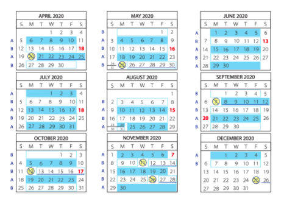
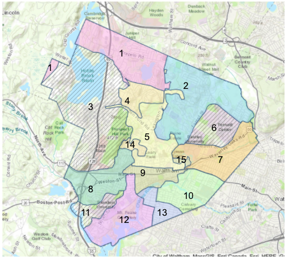
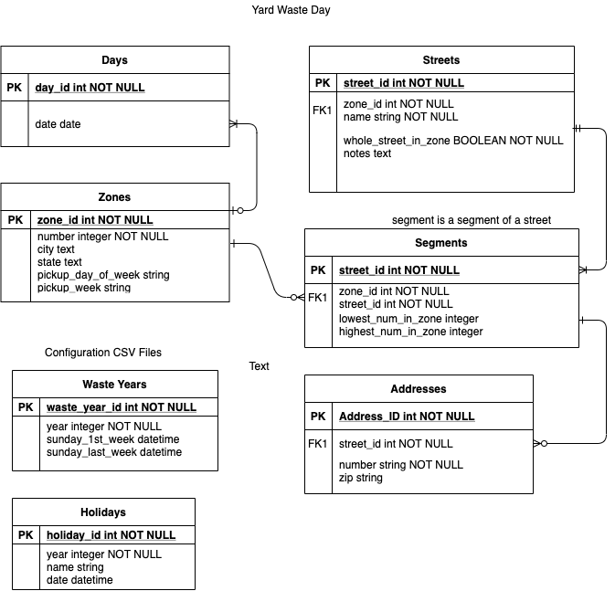

## YARD SERVICE

Yard Service is a responsive web application to help residents understand the collection service provided by their city or town, adjusting for seasons and holidays, simplifying the combination of maps and calendars provided previously.

# 
# 

## Entity Relationship Diagram
# 

## Developer
- Jeff Korenstein

## Built with
- [Ruby on Rails](https://guides.rubyonrails.org/v5.2/)

## Run Locally
The setup steps expect the following tools/versions:
- Ruby 2.7.1
- Rails 5.2.3

###### Clone the Repo
```
git clone 
```
###### Install Dependencies
```
yarn install 
bundle install 
```

###### The application can be accessed locally at <http://localhost:3000>
