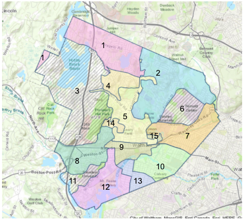

## YARD SERVICE

Yard Service is a responsive web application to help residents understand the collection service provided by their city or town, adjusting for seasons and holidays, simplifying the combination of maps and calendars provided previously.

# 
# 

## Developer
- Jeff Korenstein

## Built with
- [Ruby on Rails](https://guides.rubyonrails.org/v5.2/)
- [React.js](https://reactjs.org/docs/getting-started.html)
- [PostgreSQL](https://www.postgresql.org/docs/13/index.html)
- [Foundation](https://get.foundation/)

## Run Locally
The setup steps expect the following tools/versions:
- Ruby 2.7.1
- Rails 5.2.3
- PostgreSQL 13

###### Clone the Repo
```
git clone 
```
###### Install Dependencies
```
yarn install 
bundle install 
```

###### Create and seed the database
```
bundle exec rake db: migrate
bundle exec rake db: seed
```

###### Run the test suite
```
bundle exec rspec
```
###### Start the Rails server and webpack-dev-server
```
bundle exec rails s
yarn run start
```

###### The application can be accessed locally at <http://localhost:3000>
